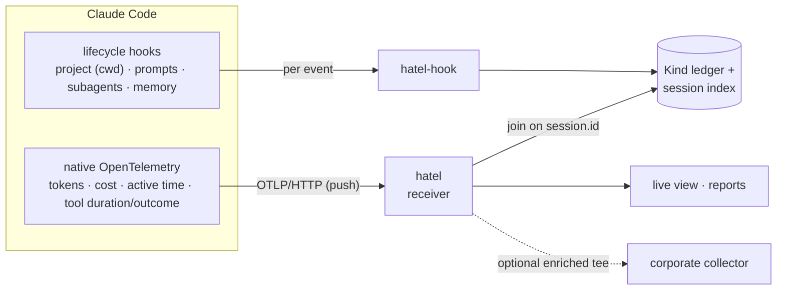
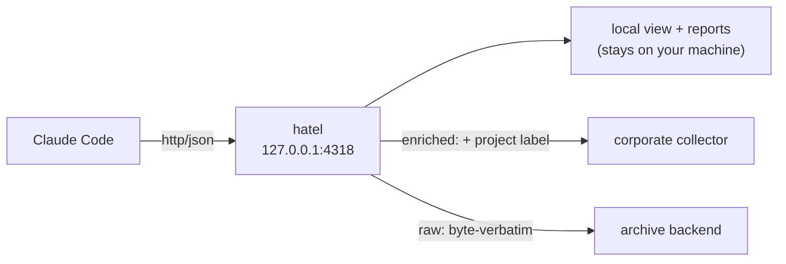

# hatel

[](https://github.com/junyeong-ai/hatel/actions/workflows/ci.yml)
[](#license)

> **English** | **[한국어](README.md)**

**Claude Code telemetry, kept local.** Collect tokens, cost, active time, and tool usage **per project, per session, and per subagent** — with no dashboards to host and, by default, no data leaving your machine.

---

## Why hatel?

- **Two signals, joined** — Claude Code already emits **native OpenTelemetry** (tokens, cost, tools) and **lifecycle hooks** (project, prompts, subagents). hatel joins them on `session.id`. Native OTel has no "which project" on the wire — hatel fills that in to give you **per-project attribution**.
- **Zero infrastructure** — a single binary, a local OTLP receiver. No Docker, no dashboard to host, no external dependency.
- **Privacy first** — an allow-list is the primary defense. Prompts store *length only*, tools store *name only* (never the text or arguments). By default everything stays on your machine.
- **Extensible** — add a custom metric with one TOML file (no code, no recompile). Record CI / deploy / gate outcomes with `emit`.
- **Sit in front of a corporate collector** — keep your existing OTLP collector; hatel sits in front and tees to it, injecting the project label.

---

## At a glance



- **Native OTel** (push) — tokens, cost, active time, lines, per-subagent attribution (`agent.name`), and per-tool duration/outcome (the `tool_result` event). It has no project on the wire, so it is **joined through the session index**.
- **Hooks** (event) — the project context (`cwd`) and the domain events OTel can't express: prompt sizes, memory loads, subagent stops, compactions — and anything a plugin defines.

| Binary | Role |
|---|---|
| `hatel-hook` | wired into `settings.json` hooks; reads one event on stdin, maps it, records matches, exits. No async runtime — **~3 ms cold start**. |
| `hatel` | the receiver (`serve`), reports, `init`, `service`, `doctor`, `kinds`, `emit`. |

---

## Quick start

```sh
# 1) Install — prebuilt binaries (receiver + hook) and the skill. No Rust toolchain
curl -fsSL https://raw.githubusercontent.com/junyeong-ai/hatel/main/scripts/install.sh | bash

# 2) Wire into Claude Code — idempotently merge the telemetry env + hooks into settings.json
hatel init
hatel doctor            # verify the wiring

# 3) Run the receiver — for always-on, use `hatel service` (below)
hatel serve --all

# 4) See a report
hatel report --window 30d
```

> Wire while installing with `... | bash -s -- --wire`. Pin a release with `HATEL_VERSION=0.4.0`. Remove everything later with `scripts/uninstall.sh`.

---

## What you actually see

After three people work on `acme-api` and `acme-web`, `hatel report --window 30d` (illustrative):

```md
# hatel — rolling 30d

| kind | top groups |
|---|---|
| compaction | — |
| memory | — |
| prompt | a1b2c3d4(2), e5f6a7b8(1) |
| subagent | Explore(2), code-reviewer(1) |
| tool | Bash [count=4, duration_ms=5730, ok=3], Edit [count=4, duration_ms=1360, ok=4], Grep [count=1, duration_ms=760, ok=1], Read [count=2, duration_ms=215, ok=2] |

## cost (latest snapshot per session)

| session | project | tokens | cost$ | active_s | lines |
|---|---|---:|---:|---:|---:|
| a1b2c3d4 | acme-api | 248913 | 1.8423 | 1284.6 | 342 |
| e5f6a7b8 | acme-api | 97540 | 0.7218 | 612.3 | 118 |
| c9d0e1f2 | acme-web | 53201 | 0.4087 | 401.7 | 76 |
```

**How to read it:**

- The **`tool`** row is per tool: `[call count, total duration ms, successes]`. `Bash [count=4, duration_ms=5730, ok=3]` = Bash called 4×, 5.73 s total (~1.4 s avg), 3 of 4 succeeded → **average latency and success rate in one line**.
- The **`cost`** table is per-session tokens, cost, active time, lines — all from **native OTel**.
- **`prompt` / `subagent`** come from **hooks** — prompts per session, which subagent ran how often.

### Live view — `hatel serve`

Leave the receiver running for a per-session, **per-subagent** live rollup:

```text
$ hatel serve --all
hatel receiver on http://127.0.0.1:4318 (all projects) — point OTEL_EXPORTER_OTLP_ENDPOINT here; Ctrl-C to stop

=== hatel (live) ===
session  project                 tokens     cost$ active_s  lines prompts skills decisions
a1b2c3d4 acme-api                248913    1.8423   1284.6    342       2      0         5
  └ Explore                        142035    1.0512
  └ main                           106878    0.7911
e5f6a7b8 acme-api                 97540    0.7218    612.3    118       1      0         3
```

> The indented `└` rows are the **per-subagent token/cost** breakdown — "which subagent spent the budget" isn't flattened away into the session total.

### Machine-readable JSON — `--format json`

For dashboards, scripts, and AI agents to parse directly:

```sh
hatel report --window 30d --kind tool --format json
```

```json
{
  "cost": [],
  "filters": [],
  "kinds": [
    {
      "groups": [
        {
          "count": 4,
          "key": "Bash",
          "sums": [
            { "name": "duration_ms", "sum": 5730.0 },
            { "name": "ok", "sum": 3.0 }
          ]
        }
      ],
      "kind": "tool"
    }
  ],
  "project": null,
  "window": "30d"
}
```

> Keys serialize in alphabetical order (`cost·filters·kinds·project·window`). Only the `Bash` group is shown above; a full report continues with `Edit·Grep·Read` in the same shape.

---

## Commands

| Command | Purpose |
|---|---|
| `serve [--port 4318] [--all] [--project N]` | OTLP/HTTP receiver + live per-session rollup (with a per-subagent token/cost breakdown when subagents run). |
| `report [--window 30d] [--format md\|text\|json] [--project N] [--kind K] [--top K] [--filter f=v]` | aggregate over a rolling window — per group: record count and the sum of each Kind's `measures`, plus the cost snapshot. |
| `init [--scope user\|project\|local] [--print] [--remove] [--insert [--mode raw\|enriched]]` | wire/unwire the telemetry env + hooks in `settings.json` — idempotent, non-destructive, atomic. |
| `service [--remove] [--print]` | install/remove the receiver as a launchd/systemd user service (runs `serve --all` for gap-free collection). |
| `doctor` | verify the wiring and report policy gaps honestly. |
| `kinds [--json]` | list the registered Kinds (core + plugins). |
| `emit <kind> [key=value...] [--json OBJ]` | record one domain signal for a registered Kind — the programmatic path for custom metrics. |

### `report` — rolling-window aggregation

```sh
hatel report --window 30d                          # everything (markdown by default) — example above
hatel report --window 7d  --format text            # terminal text
hatel report --window 30d --project acme-api       # one project
hatel report --window 30d --kind tool              # one Kind (drops the cost section)
hatel report --window 30d --kind tool --top 0      # all groups (default: top 5)
hatel report --window 30d --kind tool --filter tool_name=Bash   # only matching records
hatel report --window 30d --format json            # for dashboards / scripts
```

`--project acme-api` output:

```text
$ hatel report --window 30d --project acme-api --format text
=== hatel — rolling 30d — project acme-api ===
prompt           a1b2c3d4(2), e5f6a7b8(1)
subagent         Explore(2), code-reviewer(1)
tool             Bash [count=3, duration_ms=4230, ok=2], Edit [count=3, duration_ms=1010, ok=3], Grep [count=1, duration_ms=760, ok=1], Read [count=2, duration_ms=215, ok=2]

--- cost (latest per session) ---
a1b2c3d4 acme-api tokens=248913 cost=1.8423 active=1284.6 lines=342
e5f6a7b8 acme-api tokens=97540 cost=0.7218 active=612.3 lines=118
```

> `--filter field=value` is used with `--kind` and is repeatable (all must match). A redacted field is matched by its *original* value (hashed exactly as stored — the original never touches disk).

### `serve` — receiver + live view

```sh
hatel serve            # current project only (from cwd)
hatel serve --all      # every project sharing this collector
hatel serve --project acme-api   # one project (by label)
```

The receiver is a **single-writer daemon**: it takes an advisory lock on the state dir, so a second receiver over the same dir stands down (the cost snapshot and tool ledger have exactly one writer). It always answers `200` — the status means the body was *received*, not whether this build could decode it, so a raw tee of a body the local view can't read still succeeds and an OTLP client never retries (a retry would inflate delta counts).

### `init` — wire into Claude Code

```sh
hatel init                 # ~/.claude/settings.json (all projects)
hatel init --scope local   # .claude/settings.local.json (this repo, per-dev)
hatel init --print         # print the block instead of writing (for managed/org settings)
hatel init --remove        # cleanly undo (leaves the native telemetry env)
```

`init` wires only the events a loaded Kind consumes (`SessionStart` is always wired, for the session→project index). Tool calls aren't here — their duration and outcome come from the native `tool_result` event, not a hook.

Claude Code's own telemetry config must live in `settings.json` `env` — that is the only channel Claude Code reads at session start, and those `OTEL_*` vars are deliberately **not** passed to hook subprocesses. That is exactly why the two layers are separate. The full shape:

```jsonc
{
  "env": {
    "CLAUDE_CODE_ENABLE_TELEMETRY": "1",
    "OTEL_METRICS_EXPORTER": "otlp",
    "OTEL_LOGS_EXPORTER": "otlp",
    "OTEL_EXPORTER_OTLP_PROTOCOL": "http/json",
    "OTEL_EXPORTER_OTLP_ENDPOINT": "http://127.0.0.1:4318"
  },
  "hooks": {
    "SessionStart":      [{ "hooks": [{ "type": "command", "command": "hatel-hook" }] }],
    "UserPromptSubmit":  [{ "hooks": [{ "type": "command", "command": "hatel-hook" }] }],
    "SubagentStop":      [{ "hooks": [{ "type": "command", "command": "hatel-hook" }] }],
    "InstructionsLoaded":[{ "hooks": [{ "type": "command", "command": "hatel-hook" }] }],
    "PreCompact":        [{ "hooks": [{ "type": "command", "command": "hatel-hook" }] }]
  }
}
```

> `http/json` is required (the receiver decodes the JSON OTLP encoding, so it needs no protobuf dependency). The `command` is shown as a bare name for readability; `hatel init` writes the **absolute** path to `hatel-hook` beside `hatel`, so Claude Code can spawn it without relying on `PATH`.

### `doctor` — diagnose the wiring

`doctor` never guesses — when a signal is missing it says so and explains the consequence:

```text
$ hatel doctor
hatel doctor

settings files:
  user     found    ~/.claude/settings.json
  project  absent   ./.claude/settings.json
  local    absent   ./.claude/settings.local.json
  managed  absent   /Library/Application Support/ClaudeCode/managed-settings.json

native telemetry (settings.json env):
  ✓ CLAUDE_CODE_ENABLE_TELEMETRY=1 (from user)
  ✓ OTEL_METRICS_EXPORTER=otlp (from user)
  ✓ OTEL_LOGS_EXPORTER=otlp (from user)
  ✓ OTEL_EXPORTER_OTLP_ENDPOINT=http://127.0.0.1:4318 (from user)
  ✓ OTEL_EXPORTER_OTLP_PROTOCOL=http/json (from user)
  ✓ session.id included in metrics (default on)

hooks:
  ✓ all 5 lifecycle events invoke `hatel-hook`

storage:
  ✓ state dir writable: ~/.local/state/hatel

export:
  • http://collector.acme.internal:4318 (enriched, only: acme-api, acme-web, 1 header(s))
  ⚠ egress forwards the raw OTLP stream off this host — hatel does not redact it
  ✓ OTel is routed through this receiver — export has a stream to forward
```

### `emit` / `kinds`

```sh
hatel kinds                                              # registered Kinds and their fields
hatel emit ci_check check=lint runs:=14000 failures:=3   # record a domain signal
```

`hatel kinds` (core):

```text
$ hatel kinds
compaction     group_key=session_id    fields=[project, session_id, trigger]
memory         group_key=memory_id     fields=[load_reason, memory_id, memory_type, project, session_id]
prompt         group_key=session_id    fields=[project, prompt_len, session_id]
subagent       group_key=subagent_type fields=[project, session_id, subagent_type]
tool           group_key=tool_name     fields=[duration_ms, ok, project, session_id, tool_name]
```

---

## Forwarding to other collectors (export)

The receiver can forward what it ingests to one or more **downstream OTLP/HTTP collectors** — you no longer have to choose between hatel and a corporate collector; hatel sits in front and tees to it.



Configure destinations in `config.toml` (`$HATEL_CONFIG`, else `<config-dir>/hatel/config.toml`). Each `[[export]]` is one destination and the transform applied on the way there:

```toml
[[export]]
endpoint = "http://collector.corp:4318"   # /v1/metrics and /v1/logs are appended
mode = "enriched"                            # raw | enriched
headers = { authorization = "…" }            # e.g. downstream auth (never logged by value)
exclude_projects = ["scratch"]               # forward every project but these…
# projects = ["acme-api", "acme-web"]        # …or allow-list only these (not both)
# timeout_ms = 5000
```

- **`raw`** — forwards the incoming OTLP byte-verbatim (protocol-agnostic, so it tees a protobuf body too).
- **`enriched`** — injects the `project` label (joined from `session.id`) into each datapoint/record, so the downstream gains the **per-project attribution** raw OTel structurally lacks. It needs an `http/json` stream to transform; a datapoint whose session is unknown is forwarded unchanged (the label is never fabricated).
- **`projects` / `exclude_projects`** — keep a destination from seeing some projects (allow-list or exclude-list, one or the other). Match by label (git-root basename) or key (absolute git-root path). A batch whose project can't yet be resolved **fails closed** (not forwarded to a filtered destination), so a personal project never leaks to a corporate collector on a startup race.

> **Egress is not redacted.** `raw`/`enriched` forward the full OTLP body off the host; hatel's allow-list/hashing applies to the *hook ledger*, not to this egress. `doctor` prints this as a standing warning whenever export is configured. (Because hatel is content-free by construction it carries no prompt/tool bodies, so it is still safer than pointing Claude Code's raw OTel at a corporate collector.)

### Insert hatel in front of an existing collector

If Claude Code's endpoint already points at a corporate collector, one command captures it as an export target and repoints Claude Code at hatel — keeping the collector and gaining hatel:

```sh
hatel init --insert                 # capture the current endpoint as an enriched target, repoint CC
hatel init --insert --mode raw      # …forwarding byte-verbatim instead
```

If the endpoint is **managed-locked** and can't be repointed, `doctor` says so plainly (only the hook ledger is then available).

---

## Custom metrics (plugins)

A plugin is a single **TOML schema file** — no code, no recompile. It contributes Kinds (and optionally hook bindings) through the same loader the core uses. Point at it with `HATEL_PLUGINS=path/to/plugin.toml` (OS path-list separator for several).

Per Kind: `fields` (the single allow-list), `group_key` (the field a report groups by), `measures` (numeric fields a report **sums** — the first is the ranking metric), `redact` (hashed before storage).

A custom Kind is filled by one of two paths, **chosen by where the signal originates** (keep one writer per Kind — both paths double-counts):

**1) Hook binding** — for a signal derivable from a Claude Code lifecycle event, with zero code:

```toml
[[kind]]
name = "team.deploy"
fields = ["session_id", "project", "service", "ok"]
group_key = "service"

[[binding]]
event = "PostToolUse"
kind = "team.deploy"
map.session_id = { from = "session_id" }
map.service    = { from = "tool_name" }
map.ok         = { from = "tool_response", present = true }
```

> Field-map transforms: `from` (passthrough; a list tries each in order), `capture` (regex group 1), `len` (string length), `present` (field present → bool), `basename` (final path component), `const`. A transform that doesn't apply omits the field — never fabricated. Only when a binding maps from `git_branch` does the hook read it from `.git/HEAD` (no subprocess), so a spec slug derives with zero code: `map.spec_slug = { from = "git_branch", capture = "^spec/(.+)$" }`.

**2) `emit`** — for a domain signal that is *not* a Claude Code event (a spec-gate decision, a rule-check rollup, a deploy outcome). Your tooling records it directly:

```sh
# key=value is a string, key:=value is JSON (numbers, bools, arrays)
hatel emit ci_check check=lint date=2026-06-09 runs:=14000 failures:=3
# or a whole JSON object via --json, or piped on stdin
echo '{"check":"lint","runs":14000}' | hatel emit ci_check
```

`emit` validates the Kind, applies the same allow-list and redaction, and writes via the active sink. A field the Kind doesn't accept is dropped but **warned to stderr with the list of accepted fields** — a typo surfaces immediately. It is language-agnostic (any project, any language, calls the binary). Unlike a hook, `emit` does **not** infer the project from its working directory (a scheduler or CI job may run anywhere — guessing would mis-attribute), so include the attribution you want as payload fields. `plugins/example.toml` is a worked example.

---

## Storage & configuration

Both halves of storage go through one abstraction (`HATEL_SINK`) — emitters write via the sink, `report` reads via the same backend (a report consumes SQLite exactly as it does JSONL):

- **`jsonl`** (default) — one append-only file per Kind, rotated at 10 MB (`HATEL_ROTATE_BYTES`). Git-friendly, greppable, zero dependencies.
- **`sqlite`** — embedded, WAL, indexed by `(kind, ts)` so windowed reads stay cheap (the window is filtered in SQL).

State lives under the XDG state dir (`~/.local/state/hatel`, or the platform equivalent); override with `HATEL_STATE_DIR`. The session index and the cost snapshot are always written there independent of the sink (the receiver needs the index to attribute project-less OTel data).

### Environment variables

| Variable | Effect |
|---|---|
| `HATEL_SINK` | `jsonl` (default) / `sqlite` |
| `HATEL_STATE_DIR` | override the state directory |
| `HATEL_CONFIG` | override the `config.toml` path (the export destinations) |
| `HATEL_PLUGINS` | plugin TOML paths, OS path-list separator (`:` Unix, `;` Windows) |
| `HATEL_ROTATE_BYTES` | JSONL rotation threshold (default 10 MB) |
| `HATEL_RETENTION_DAYS` | retention horizon for everything stored — the cost snapshot, rotated ledger archives, SQLite rows (default 90, max 100000); the receiver sweeps daily, never the active ledger file |
| `HATEL_DISABLED=1` | turn the hook into a no-op |
| `HATEL_STRICT=1` | error (don't silently drop) on a payload key outside the allow-list |
| `HATEL_TESTING=1` | redirect writes under a `_test/` subdirectory |

> These configure the *collector itself* and are unrelated to Claude Code's `OTEL_*` telemetry settings, which live in `settings.json`.

---

## Privacy

- **The allow-list is the primary defense** — the core ships **no** content-bearing fields. Prompts store length, tools store the name (never the text or arguments). This mirrors Claude Code's own default-off `OTEL_LOG_USER_PROMPTS` / `OTEL_LOG_TOOL_DETAILS`.
- `redact` fields are hashed (BLAKE3, 16 hex chars) before write.
- Event records carry the project **label** only; the absolute git-root path lives solely in the local session index.
- Everything stays on your machine. Failures are fail-open: a write error degrades to a stderr note and never blocks a tool call.

## Always-on collection (no gaps)

Native OTel is push-only — tokens and cost are captured only while the receiver runs. For gap-free collection, install it as a background service; `hatel` writes and loads the unit for you (launchd on macOS, systemd `--user` on Linux):

```sh
hatel service           # install + start: runs `serve --all`, kept alive across login/failure
hatel service --remove  # stop and remove it
hatel service --print   # print the unit instead of installing — to inspect or hand to MDM
```

> The unit runs the exact binary that installed it, so re-running `hatel service` after a `cargo install` or path move repoints it. (`scripts/install.sh --service` does this in the same step as install.)

## Enterprise / managed settings

The collector never fights managed policy; it adapts:

- **OTel repointed at a corporate collector** — the local hook ledger keeps working; the `session.id` join holds wherever the native data lands, so metrics query from the corporate backend and join to the local domain ledger by session.
- **`allowManagedHooksOnly`** — user/project hooks are blocked, so IT deploys `hatel-hook` as a *managed* hook (the single static binary ships via MDM). `doctor` detects this from the file-based managed settings.
- **`OTEL_METRICS_INCLUDE_SESSION_ID=false`** — per-session attribution becomes impossible. `doctor` reports it plainly; org/user aggregates still work. There is no guessed fallback — an unavailable signal is reported as unavailable, never fabricated.

---

## Layout

```
crates/core   async-free library: model, registry, schema, pii, rolling, sinks, session, hook, report
crates/hook   the lean hook binary (core only)
crates/cli    the receiver, reports, doctor (core + tokio/axum)
plugins/      example declarative plugins
```

## License

MIT OR Apache-2.0.
