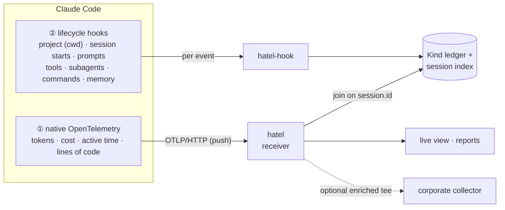
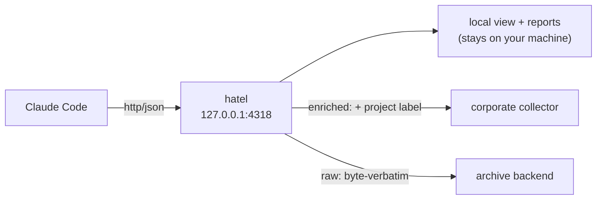

# hatel

[](https://github.com/junyeong-ai/hatel/actions/workflows/ci.yml)
[](#license)

> **English** | **[한국어](README.md)**

**See the tokens, cost, and time Claude Code spends — on your own laptop.** Collect tokens, cost, active time, and tool usage **per project, per session, and per subagent** — with no dashboard to host and no SaaS to sign up for. By default, data never leaves your machine.

```text
| tool | Bash [count=4, duration_ms=5730, ok=3], Edit [count=4, duration_ms=1360, ok=4], … |

| session  | project  | tokens | cost$  | active_s | lines |
| a1b2c3d4 | acme-api | 248913 | 1.8423 |   1284.6 |   342 |
```

---

## Why hatel?

- **🧩 Two signals, joined** — Claude Code emits **native OpenTelemetry** (tokens, cost) and **lifecycle hooks** (project, prompts, subagents). hatel joins them on `session.id`. Native OTel has no "which project" on the wire — hatel fills that in.
- **📦 Zero infrastructure** — two small static binaries (the receiver + the hook), a local OTLP collector. No Docker, no dashboard to host, no external dependency.
- **🔒 Privacy first** — prompts store *length only*, tools store *name only* (a `Skill` call also the skill it loaded; never the text or any other argument). By default everything stays on your machine.
- **🧱 Extensible** — add a custom metric with one TOML file (no code, no recompile). Record CI / deploy / gate outcomes with one `emit`.
- **🔌 Sit in front of a corporate collector** — keep your existing OTLP collector; hatel sits in front and tees to it, injecting the project label.

---

## How it works (60 seconds)

Claude Code **already** emits two streams. hatel just joins them in one place:


```mermaid
flowchart LR
  subgraph CC["Claude Code"]
    M["① native OpenTelemetry<br/>tokens · cost · active time · lines of code"]
    H["② lifecycle hooks<br/>project (cwd) · session starts · prompts<br/>tools · subagents · commands · memory"]
  end
  M -->|"OTLP/HTTP (push)"| R["hatel<br/>receiver"]
  H -->|"per event"| K["hatel-hook"]
  K --> IDX[("Kind ledger +<br/>session index")]
  R -->|"join on session.id"| IDX
  R --> OUT["live view · reports"]
  R -.->|"optional enriched tee"| CORP["corporate collector"]
```

| | What it gives | Why it's needed |
|---|---|---|
| **① Native OTel** (push) | tokens, cost, active time, lines, per-subagent attribution (`agent.name`) | exact numbers — but **no project on the wire** |
| **② Hooks** (event) | project (`cwd`), session starts and what resuming cost, prompt sizes, memory loads, tool calls, subagents, compactions | the "which project, what happened" context |

> **The key idea**: ①'s numbers have no project label. hatel joins ②'s session→project mapping on `session.id` to produce **per-project attribution**. That's how "how much did `acme-api` spend" becomes one line.

Two small binaries do the work:

| Binary | Role |
|---|---|
| `hatel-hook` | wired into `settings.json` hooks; reads one event on stdin, maps it, records matches, exits. No async runtime — **single-digit-millisecond cold start** (~1 ms over a bare process spawn). |
| `hatel` | the receiver (`serve`), reports, `init`, `service`, `doctor`, `kinds`, `emit`, the MCP server (`mcp`). |

---

## Quick start

```sh
# 1) Install — prebuilt binaries (receiver + hook) and the skill. No Rust toolchain
curl -fsSL https://raw.githubusercontent.com/junyeong-ai/hatel/main/scripts/install.sh | bash

# 2) Wire into Claude Code — idempotently merge the telemetry env + hooks into settings.json
hatel init
hatel doctor            # verify the wiring (look for green ✓)

# 3) Run the receiver — for always-on, use `hatel service` (below)
hatel serve --all

# 4) Use Claude Code as usual, then see a report
hatel report --window 30d
```

> 💡 Wire while installing with `... | bash -s -- --wire` — or do the service and MCP registration in one go with `--wire --service --mcp`. Pin a release with `HATEL_VERSION=0.4.3`. Remove everything later with `scripts/uninstall.sh`.

> ⚠️ **Cost and tokens are captured only while the receiver is running** (native OTel is push-only). So you don't have to remember to start it, run it as a background service with `hatel service` ([Always-on collection](#always-on-collection-no-gaps)).

---

## What you actually see

After three people work on `acme-api` and `acme-web`, `hatel report --window 30d` (illustrative):

```md
# hatel — rolling 30d

## prompt — by session_id, ranked by count

| session_id | count |
|---|---:|
| a1b2c3d4 | 2 |
| e5f6a7b8 | 1 |

## session — by source, ranked by estimated_cache_write_usd

| source | count | estimated_cache_write_usd | context_tokens |
|---|---:|---:|---:|
| resume | 12 | 5.04 | 487,220 |
| compact | 5 | 1.93 | 186,540 |
| fork | 2 | 0.71 | 71,026 |
| startup | 4 | 0 | 0 |

## subagent — by agent, ranked by count

| agent | count |
|---|---:|
| Explore | 2 |
| code-reviewer | 1 |

## tool — by tool_name, ranked by duration_ms

| tool_name | count | duration_ms | ok |
|---|---:|---:|---:|
| Bash | 4 | 5,730 | 3 |
| Edit | 4 | 1,360 | 4 |
| Grep | 1 | 760 | 1 |
| Read | 2 | 215 | 2 |

## cost — by project, ranked by cost_usd

| project | sessions | tokens | cost_usd | active_time_s | lines |
|---|---:|---:|---:|---:|---:|
| acme-api | 2 | 346,453 | 2.56 | 1,896.90 | 460 |
| acme-web | 1 | 53,201 | 0.41 | 401.70 | 76 |
```

**How to read it:**

- Every section names its axes: **`by <dimension>, ranked by <measure>`**. That is the question the section answers, and both halves are yours to change — `--group-by` / `--sort-by`.
- The **`tool`** section is per tool: call count, total duration ms, successes. `Bash | 4 | 5,730 | 3` = Bash called 4×, 5.73 s total (~1.4 s avg), 3 of 4 succeeded → **average latency and success rate in one row**. `--group-by agent_id` separates delegated calls (the row with no value is the main agent), and `--group-by prompt_id` groups the work one request set off.
- The **`session`** section counts the times a context was established — besides `startup`, each of `resume`, `fork`, `clear` and `compact` fires `SessionStart` again on an existing conversation, so one session is counted more than once. The measures are what rebuilding the prompt cache cost on those starts, spend that appears in no session total. Grouping by `cache_likely_expired` separates the part that was avoidable.
- The **`cost`** section rolls the native-OTel snapshot up by project. `--format json` keeps the per-session rows whole, so it can be joined against your own records.
- The **`memory`** section is which instruction files entered context, named by their path in the repository (outside it, `~/…` under home and absolute elsewhere); the same path in two repositories shares a row until you add `--project` or `--group-by project`. Rebuilding context (`session_start`, `compact`) announces every file again, an @-imported one as `include` with `parent_file_path`. A load a file access set off carries `trigger_file_path`, the file that pulled it in, and skips a file the context already holds, so a missing load does not mean the file was absent. `prompt_id` is the latest prompt submitted when the load happened.
- The **`command`** section is the slash commands and skills that were explicitly invoked. A skill the model loads on its own expands nothing, so it is not counted here; `--kind tool --filter tool_name=Skill --group-by skill` names those, a call that failed included.
- **`prompt` / `subagent`** come from **hooks** — prompts per session, how often each subagent was spawned. A subagent emits a stop event at every turn boundary, so runs are counted by `agent_id`. The `agent` value is the label the event carries: the declared type for a plain subagent, the name you gave it for a teammate. An `(empty)` row is an agent Claude Code ran for itself — not one the conversation spawned, so it carries no type, keeps no transcript, and makes no tool calls.

> A Kind with nothing in the window says so in place of its table, and Kinds you have no records for are listed the same way (omitted above for brevity). Start the receiver and run Claude Code once and they fill in (see [Troubleshooting](#troubleshooting)).

### Live view — `hatel serve`

Leave the receiver running for a per-session, **per-subagent** live rollup:

```text
$ hatel serve --all
hatel receiver on http://127.0.0.1:4318 (all projects) — point OTEL_EXPORTER_OTLP_ENDPOINT here; Ctrl-C to stop

=== hatel (live) ===
session  project                 tokens     cost$ active_s  lines prompts skills decisions
a1b2c3d4 acme-api                248913    1.8423   1284.6    342       2      0         5
  └ Explore                        142035    1.0512
  └ main                           106878    0.7911
e5f6a7b8 acme-api                 97540    0.7218    612.3    118       1      0         3
```

> The indented `└` rows are the **per-subagent token/cost** breakdown — "which subagent spent the budget" isn't flattened away into the session total.

### Machine-readable JSON — `--format json`

For dashboards, scripts, and AI agents to parse directly:

```sh
hatel report --window 30d --kind tool --format json
```

```json
{
  "cost": [],
  "filters": [],
  "kinds": [
    {
      "group_by": "tool_name",
      "groups": [
        {
          "count": 4,
          "key": "Bash",
          "sums": [
            { "name": "duration_ms", "sum": 5730.0 },
            { "name": "ok", "sum": 3.0 }
          ]
        }
      ],
      "kind": "tool",
      "project_scope": "unrestricted",
      "sort_by": "duration_ms"
    }
  ],
  "project": null,
  "top_n": 5,
  "unreadable_kinds": null,
  "window": "30d"
}
```

> Keys serialize in alphabetical order. Only the `Bash` group is shown above; a full report continues with `Edit·Grep·Read` in the same shape. A group's `key` is `null` for the records that carry no value for the dimension at all (the `—` row of the text and markdown views), so a reader tells an absent field from any value by shape rather than by a glyph. A non-null `unreadable_kinds` means **the ledger holds Kinds no loaded schema declares** — the rollup answered over less than was collected, and the names and the place to fix it come with it (see [custom metrics](#custom-metrics-plugins)).

In a full report (no `--kind`), each `cost` row serializes three breakdowns alongside its totals — `tokens_by_type` (`input`/`output`/`cacheRead`/`cacheCreation` — the cache-hit accounting), `by_model` (tokens and cost per model — the model mix), and `by_agent` (tokens and cost per subagent). In each breakdown, a series missing the attribute lands in an `(unattributed)` bucket — never guessed. Sessions recorded before the breakdowns existed show empty objects (`{}`) — exactly the fact that nothing was recorded.

### The MCP server — `hatel mcp`

AI agents get **typed MCP tools** instead of stdout parsing — `report`, `kinds`, `doctor`, and `emit` served over a stdio MCP server; the three read tools return exactly the JSON their CLI counterparts print (`--format json` / `--json`), and `emit` answers with its outcome (including any dropped-field warning) as text:

```sh
claude mcp add hatel -- hatel mcp
```

---

## Commands

| Command | Purpose |
|---|---|
| `serve [--port 4318] [--all] [--project N]` | OTLP/HTTP receiver + live per-session rollup (with a per-subagent token/cost breakdown when subagents run). |
| `report [--window 30d] [--format md\|text\|json] [--project N] [--kind K] [--top K] [--group-by F] [--sort-by M] [--filter f=v]` | aggregate over a rolling window — per group: record count and the sum of each Kind's `measures`, plus the cost snapshot. |
| `init [--scope user\|project\|local] [--print] [--remove] [--insert [--mode raw\|enriched]]` | wire/unwire the telemetry env + hooks in `settings.json` — idempotent, non-destructive, atomic. |
| `service [--remove] [--print]` | install/remove the receiver as a launchd/systemd user service (runs `serve --all` for gap-free collection). |
| `doctor [--json]` | verify the wiring and report policy gaps honestly — `--json` renders the same findings machine-readably. |
| `kinds [--json]` | list the registered Kinds (core + plugins) — and any the ledger holds that no schema declares. |
| `emit <kind> [key=value...] [--json OBJ]` | record one domain signal for a registered Kind — the programmatic path for custom metrics. |
| `mcp` | stdio server exposing `report` / `kinds` / `doctor` / `emit` as typed MCP tools (for agents). |

### `report` — rolling-window aggregation

```sh
hatel report --window 30d                          # everything (markdown by default) — example above
hatel report --window 7d  --format text            # terminal text
hatel report --window 30d --project acme-api       # one project
hatel report --window 30d --kind tool              # one Kind (drops the cost section)
hatel report --window 30d --kind tool --top 0      # all groups (default: top 5)
hatel report --window 30d --kind tool --filter tool_name=Bash   # only matching records
hatel report --window 30d --kind ci_check --group-by date       # a different dimension
hatel report --window 30d --kind ci_check --sort-by failures    # a different ranking
hatel report --window 30d --format json            # for dashboards / scripts
```

`--project acme-api` output:

```text
$ hatel report --window 30d --project acme-api --format text
=== hatel — rolling 30d — project acme-api ===

compaction — by session_id, ranked by count
  (no records in this window)

memory — by file_path, ranked by count
  (no records in this window)

prompt — by session_id, ranked by count
                      session_id  count
  ██████████████████  a1b2c3d4        2
  █████████░░░░░░░░░  e5f6a7b8        1

subagent — by agent, ranked by count
                      agent          count
  ██████████████████  Explore            2
  █████████░░░░░░░░░  code-reviewer      1

tool — by tool_name, ranked by duration_ms
                      tool_name  count  duration_ms  ok
  ██████████████████  Bash           4        5,730   3
  ███░░░░░░░░░░░░░░░  Edit           3        1,020   3
  ██░░░░░░░░░░░░░░░░  Grep           1          760   1
  ░░░░░░░░░░░░░░░░░░  Read           1          110   1

cost — by project, ranked by cost_usd
                      project   sessions   tokens  cost_usd  active_time_s  lines
  ██████████████████  acme-api         2  346,453      2.56       1,896.90    460
```

> `--filter field=value` is used with `--kind` and is repeatable (all must match). A redacted field is matched by its *original* value (hashed exactly as stored — the original never touches disk).

A Kind that does not record `project` cannot be selected by a project scope, and says so in place of its table rather than showing an empty one — "outside this scope" is not "none of it happened".

A project is the repository, not the checkout: work done in a linked worktree attributes to the repository it belongs to, so a spec branch's usage lands in that project's totals instead of a project named after the branch. Work outside a repository has no project at all: a directory is where a project was found, not one itself, so such a session carries no project label rather than one named after the directory it ran in.

### `serve` — receiver + live view

```sh
hatel serve            # current project only (from cwd)
hatel serve --all      # every project sharing this collector
hatel serve --project acme-api   # one project (by label)
```

The receiver is a **single-writer daemon**: it takes an advisory lock on the state dir, so a second receiver over the same dir stands down (the cost snapshot has exactly one writer). It always answers `200` — the status means the body was *received*, not whether this build could decode it, so a raw tee of a body the local view can't read still succeeds and an OTLP client never retries (a retry would inflate delta counts).

### `init` — wire into Claude Code

```sh
hatel init                 # ~/.claude/settings.json (all projects)
hatel init --scope local   # .claude/settings.local.json (this repo, per-dev)
hatel init --print         # print the block instead of writing (for managed/org settings)
hatel init --remove        # cleanly undo (leaves the native telemetry env)
```

`init` wires only the events a loaded Kind consumes (`SessionStart` is always wired, for the session→project index). An event no Kind binds is left unwired, so the hook never runs for no record. The wiring is `async`, so a tool call never waits on a record being written — a collection gap is what `hatel doctor` is for.

Claude Code's own telemetry config must live in `settings.json` `env` — that is the only channel Claude Code reads at session start, and those `OTEL_*` vars are deliberately **not** passed to hook subprocesses. That is exactly why the two layers are separate. The full shape:

```jsonc
{
  "env": {
    "CLAUDE_CODE_ENABLE_TELEMETRY": "1",
    "OTEL_METRICS_EXPORTER": "otlp",
    "OTEL_LOGS_EXPORTER": "otlp",
    "OTEL_EXPORTER_OTLP_PROTOCOL": "http/json",
    "OTEL_EXPORTER_OTLP_ENDPOINT": "http://127.0.0.1:4318"
  },
  "hooks": {
    "SessionStart":        [{"hooks":[{"async":true,"command":"hatel-hook","type":"command"}]}],
    "UserPromptExpansion": [{"hooks":[{"async":true,"command":"hatel-hook","type":"command"}]}],
    "PostToolUse":         [{"hooks":[{"async":true,"command":"hatel-hook","type":"command"}]}],
    "PostToolUseFailure":  [{"hooks":[{"async":true,"command":"hatel-hook","type":"command"}]}],
    "UserPromptSubmit":    [{"hooks":[{"async":true,"command":"hatel-hook","type":"command"}]}],
    "SubagentStop":        [{"hooks":[{"async":true,"command":"hatel-hook","type":"command"}]}],
    "InstructionsLoaded":  [{"hooks":[{"async":true,"command":"hatel-hook","type":"command"}]}],
    "PreCompact":          [{"hooks":[{"async":true,"command":"hatel-hook","type":"command"}]}]
  }
}
```

> `http/json` is required (the receiver decodes the JSON OTLP encoding, so it needs no protobuf dependency). The `command` is shown as a bare name for readability; `hatel init` writes the **absolute** path to `hatel-hook` beside `hatel`, so Claude Code can spawn it without relying on `PATH`.

### `doctor` — diagnose the wiring

`doctor` never guesses — when a signal is missing it says so and explains the consequence:

```text
$ hatel doctor
hatel doctor

settings files:
  user     found    ~/.claude/settings.json
  project  absent   ./.claude/settings.json
  local    absent   ./.claude/settings.local.json
  managed  absent   /Library/Application Support/ClaudeCode/managed-settings.json

native telemetry (settings.json env):
  ✓ CLAUDE_CODE_ENABLE_TELEMETRY=1 (from user)
  ✓ OTEL_METRICS_EXPORTER=otlp (from user)
  ✓ OTEL_LOGS_EXPORTER=otlp (from user)
  ✓ OTEL_EXPORTER_OTLP_ENDPOINT=http://127.0.0.1:4318 (from user)
  ✓ OTEL_EXPORTER_OTLP_PROTOCOL=http/json (from user)
  ✓ session.id included in metrics (default on)

hooks:
  ✓ all 8 lifecycle events invoke `hatel-hook`
  ✓ wired hook `/home/you/.local/bin/hatel-hook` is this build (0.14.0)

storage:
  ✓ state dir writable: ~/.local/state/hatel

export:
  • http://collector.acme.internal:4318 (enriched, only: acme-api, acme-web, 1 header(s))
  ⚠ egress forwards the raw OTLP stream off this host — hatel does not redact it
  ✓ OTel is routed through this receiver — export has a stream to forward
```

> The `export:` section appears only when export is configured. `doctor` also ends with the **same reference settings block** `hatel init` writes (for pasting into managed/org settings) — identical to the [`init`](#init--wire-into-claude-code) block above, so it's elided here.

`hatel doctor --json` renders the same findings as stable JSON — each section's `findings` carry a `status` (`ok`/`fail`/`warn`/`note`) and `message`, and the top-level `ok` plus the exit code semantics (non-zero only on a hard-requirement failure) match the human output.

### `emit` / `kinds`

```sh
hatel kinds                                              # registered Kinds and their fields
hatel emit ci_check check=lint runs:=14000 failures:=3 project=acme-api   # record a domain signal
```

`hatel kinds` (core):

```text
$ hatel kinds
command        group_key=command_name fields=[command_name, project, prompt_id, session_id]
compaction     group_key=session_id   fields=[project, prompt_id, session_id, trigger]
memory         group_key=file_path    fields=[file_path, load_reason, memory_type, parent_file_path, project, prompt_id, session_id, trigger_file_path]
prompt         group_key=session_id   fields=[project, prompt_id, prompt_len, session_id]
session        group_key=source       fields=[cache_likely_expired, context_tokens, estimated_cache_write_usd, project, session_id, since_last_response_s, source]
subagent       group_key=agent        fields=[agent, agent_id, project, prompt_id, session_id] identity=agent_id
tool           group_key=tool_name    fields=[agent_id, duration_ms, ok, project, prompt_id, session_id, skill, tool_name, tool_use_id] identity=tool_use_id
```

When the ledger holds a Kind no loaded schema declares, one more line follows the list — the other half of an honest answer to what was asked ("what can I query"). `--json` carries the same fact as `{ "kinds": [...], "unreadable_kinds": { "names": [...], "plugin_source": "..." } }`, and `unreadable_kinds` is `null` when there is no gap:

```text
$ hatel kinds
...
tool           group_key=tool_name    fields=[agent_id, duration_ms, ok, project, prompt_id, session_id, skill, tool_name, tool_use_id] identity=tool_use_id

the ledger holds team.deploy, which no loaded schema declares — those records stay uncountable until a plugin that declares them is listed in ~/.config/hatel/config.toml
```

---

## Forwarding to other collectors (export)

The receiver can forward what it ingests to one or more **downstream OTLP/HTTP collectors** — you no longer have to choose between hatel and a corporate collector; hatel sits in front and tees to it.


```mermaid
flowchart LR
  CC["Claude Code"] -->|"http/json"| R["hatel<br/>127.0.0.1:4318"]
  R --> L["local view + reports<br/>(stays on your machine)"]
  R -->|"enriched: + project label"| CORP["corporate collector"]
  R -->|"raw: byte-verbatim"| ARC["archive backend"]
```

Configure destinations in `config.toml` (`$HATEL_CONFIG`, else `<config-dir>/hatel/config.toml`). Each `[[export]]` is one destination and the transform applied on the way there:

```toml
[[export]]
endpoint = "http://collector.corp:4318"   # /v1/metrics and /v1/logs are appended
mode = "enriched"                            # raw | enriched
headers = { authorization = "…" }            # e.g. downstream auth (never logged by value)
exclude_projects = ["scratch"]               # forward every project but these…
# projects = ["acme-api", "acme-web"]        # …or allow-list only these (not both)
# timeout_ms = 5000
```

- **`raw`** — forwards the incoming OTLP byte-verbatim (protocol-agnostic, so it tees a protobuf body too).
- **`enriched`** — injects the `project` label (joined from `session.id`) into each datapoint/record, so the downstream gains the **per-project attribution** raw OTel structurally lacks. It needs an `http/json` stream to transform; a datapoint whose session is unknown is forwarded unchanged (the label is never fabricated).
- **`projects` / `exclude_projects`** — keep a destination from seeing some projects (allow-list or exclude-list, one or the other). Match by label (the repository's basename) or key (its absolute path). A batch whose project can't yet be resolved **fails closed** (not forwarded to a filtered destination), so a personal project never leaks to a corporate collector on a startup race.

> **Egress is not redacted.** `raw`/`enriched` forward the full OTLP body off the host; hatel's allow-list/hashing applies to the *hook ledger*, not to this egress. `doctor` prints this as a standing warning whenever export is configured. (Because hatel is content-free by construction it carries no prompt/tool bodies, so it is still safer than pointing Claude Code's raw OTel at a corporate collector.)

### Insert hatel in front of an existing collector

If Claude Code's endpoint already points at a corporate collector, one command captures it as an export target and repoints Claude Code at hatel — keeping the collector and gaining hatel:

```sh
hatel init --insert                 # capture the current endpoint as an enriched target, repoint CC
hatel init --insert --mode raw      # …forwarding byte-verbatim instead
```

If the endpoint is **managed-locked** and can't be repointed, `doctor` says so plainly (only the hook ledger is then available).

---

## Custom metrics (plugins)

A plugin is a single **TOML schema file** — no code, no recompile. It contributes Kinds (and optionally hook bindings) through the same loader the core uses. List it under `plugins` in `config.toml`, so every command — the hook that writes, the report that reads — resolves the same Kinds:

```toml
plugins = ["schemas/aix.toml"]   # relative paths resolve against config.toml's own directory
```

`HATEL_PLUGINS` overrides the list for one process (OS path-list separator for several) — a Kind registered that way is invisible to any command run without it, so durable registration belongs in `config.toml`.

When the ledger holds a Kind no loaded schema declares — records that were collected but that nothing can read — **every read path** says so alongside its answer: `doctor`'s findings, the last line of `kinds` and `unreadable_kinds` in its `--json`, `unreadable_kinds` on every report, and the error for asking about that Kind with `--kind`. That is what keeps a partial registry from answering as a complete one, and each message names the surface where the schema would be listed:

```text
$ hatel report --kind team.deploy
report: unknown kind "team.deploy" (registered: command, compaction, memory, prompt, session, subagent, tool) — it has records in the ledger, but no loaded schema declares it; list its plugin in ~/.config/hatel/config.toml
```

Per Kind: `fields` (the single allow-list), `group_key` (the field a report groups by), `measures` (numeric fields a report **sums** — the first is the ranking metric), `redact` (hashed before storage), `identity` (the field identifying the entity a record describes, when several records describe the same one — a report then counts entities, not records).

A custom Kind is filled by one of two paths, **chosen by where the signal originates** (keep one writer per Kind — both paths double-counts):

**1) Hook binding** — for a signal derivable from a Claude Code lifecycle event, with zero code:

```toml
[[kind]]
name = "team.deploy"
fields = ["session_id", "project", "service", "ok"]
group_key = "service"

[[binding]]
event = "PostToolUse"
kind = "team.deploy"
map.session_id = { from = "session_id" }
map.service    = { from = "tool_name" }
map.ok         = { from = "tool_response", present = true }
```

> Field-map transforms: `from` (passthrough; a list tries each in order; a JSON Pointer such as `/tool_input/skill` reads a nested value), `capture` (regex group 1), `len` (string length), `present` (field present → bool), `basename` (final path component), `repo_path` (path relative to the repository checkout the session runs in; outside it, `~/…` under home, otherwise unchanged), `const`. `when = { tool_name = "Skill" }` writes the field only for events whose sources equal those values. A transform that doesn't apply omits the field — never fabricated. Only when a binding reads `git_branch`, as a source or a condition, does the hook read it from `.git/HEAD` (no subprocess), so a spec slug derives with zero code: `map.spec_slug = { from = "git_branch", capture = "^spec/(.+)$" }`.

**2) `emit`** — for a domain signal that is *not* a Claude Code event (a spec-gate decision, a rule-check rollup, a deploy outcome). Your tooling records it directly:

```sh
# key=value is a string, key:=value is JSON (numbers, bools, arrays)
hatel emit ci_check check=lint date=2026-06-09 runs:=14000 failures:=3 project=acme-api
# or a whole JSON object via --json, or piped on stdin
echo '{"check":"lint","runs":14000,"project":"acme-api"}' | hatel emit ci_check
```

`emit` validates the Kind, applies the same allow-list and redaction, and writes via the active sink. A field the Kind doesn't accept is dropped but **warned to stderr with the list of accepted fields** — a typo surfaces immediately:

```text
$ hatel emit ci_check check=lint runs:=14000 failurez:=3
emit: ci_check does not accept ["failurez"] (dropped) — accepted fields: actor, check, date, failures, project, runs
```

It is language-agnostic (any project, any language, calls the binary). Unlike a hook, `emit` does **not** infer the project from its working directory (a scheduler or CI job may run anywhere — guessing would mis-attribute), so include the attribution you want as payload fields. `plugins/example.toml` is a worked example.

---

## Storage & configuration

Both halves of storage go through one abstraction (`HATEL_SINK`) — emitters write via the sink, `report` reads via the same backend (a report consumes SQLite exactly as it does JSONL):

- **`jsonl`** (default) — one append-only file per Kind, rotated at 10 MB (`HATEL_ROTATE_BYTES`). Git-friendly, greppable, zero dependencies.
- **`sqlite`** — embedded, WAL, indexed by `(kind, ts)` so windowed reads stay cheap (the window is filtered in SQL).

State lives under the XDG state dir (`~/.local/state/hatel`, or the platform equivalent); override with `HATEL_STATE_DIR`. The session index and the cost snapshot are always written there independent of the sink (the receiver needs the index to attribute project-less OTel data).

### Environment variables

| Variable | Effect |
|---|---|
| `HATEL_SINK` | `jsonl` (default) / `sqlite` |
| `HATEL_STATE_DIR` | override the state directory |
| `HATEL_CONFIG` | override the `config.toml` path (the export destinations) |
| `HATEL_PLUGINS` | plugin TOML paths, overriding `config.toml`'s `plugins`; OS path-list separator (`:` Unix, `;` Windows) |
| `HATEL_ROTATE_BYTES` | JSONL rotation threshold (default 10 MB) |
| `HATEL_RETENTION_DAYS` | retention horizon for everything stored — the cost snapshot, rotated ledger archives, SQLite rows (default 90, max 100000); the receiver sweeps daily, never the active ledger file |
| `HATEL_DISABLED=1` | turn the hook into a no-op |
| `HATEL_STRICT=1` | error (don't silently drop) on a payload key outside the allow-list |
| `HATEL_TESTING=1` | redirect writes under a `_test/` subdirectory |

> These configure the *collector itself* and are unrelated to Claude Code's `OTEL_*` telemetry settings, which live in `settings.json`.

---

## Privacy

- **The allow-list is the primary defense** — the core ships **no** content-bearing fields. Prompts store length, tools store the name — a `Skill` call also the name of the skill it loaded, which no other signal carries; never the text or any other argument. This mirrors Claude Code's own default-off `OTEL_LOG_USER_PROMPTS` / `OTEL_LOG_TOOL_DETAILS`.
- `redact` fields are hashed (BLAKE3, 16 hex chars) before write.
- Event records carry the project **label** only; the absolute repository path lives solely in the local session index. A session outside a repository records no label, so a home or scratch directory never becomes one.
- Everything stays on your machine. Failures are fail-open: a write error degrades to a stderr note and never blocks a tool call.

---

## Always-on collection (no gaps)

Native OTel is push-only — tokens and cost are captured only while the receiver runs. For gap-free collection, install it as a background service; `hatel` writes and loads the unit for you (launchd on macOS, systemd `--user` on Linux):

```sh
hatel service           # install + start: runs `serve --all`, kept alive across login/failure
hatel service --remove  # stop and remove it
hatel service --print   # print the unit instead of installing — to inspect or hand to MDM
```

> The unit runs the exact binary that installed it, so re-running `hatel service` after a `cargo install` or path move repoints it. (`scripts/install.sh --service` does this in the same step as install.)

---

## Enterprise / managed settings

The collector never fights managed policy; it adapts:

- **OTel repointed at a corporate collector** — the local hook ledger keeps working; the `session.id` join holds wherever the native data lands, so metrics query from the corporate backend and join to the local domain ledger by session.
- **`allowManagedHooksOnly`** — user/project hooks are blocked, so IT deploys `hatel-hook` as a *managed* hook (the single static binary ships via MDM). `doctor` detects this from the file-based managed settings.
- **`OTEL_METRICS_INCLUDE_SESSION_ID=false`** — per-session attribution becomes impossible. hatel **drops** these session-less metrics rather than guess, and `doctor` reports it plainly (org/user-level aggregation survives only at a collector you forward the raw stream to). An unavailable signal is reported as unavailable, never fabricated.

---

## Troubleshooting

| Symptom | Cause / fix |
|---|---|
| **Report is all `—`** | No data yet. ① `hatel doctor` to confirm wiring → ② run the receiver (`hatel serve --all` or `hatel service`) → ③ do some work in Claude Code → `hatel report` again. |
| **Hook Kinds show up but `cost`/`tokens` are empty** | Cost and tokens are native OTel metrics, so they come **through the receiver**. The hook ledger accrues without it, but those two need it running *at that moment*. Run `hatel service` for always-on. |
| **A hook Kind's numbers look doubled** | `hatel-hook` is reached twice for one event — bound in both the user `settings.json` and a project `.claude/settings.json`, or the project one calls a wrapper script that runs `hatel-hook` again. Hook envelopes carry no event-unique identifier, so hatel cannot tell a duplicate delivery from a genuine repeat; remove one of the two bindings. `subagent` and `tool` are unaffected — they count entities by `agent_id` and `tool_use_id`. |
| **`doctor` shows `⚠ wired hook … names no version` / `… did not name its build` / `… is <version> while this hatel is …`** | The hook Claude Code runs is a different build from `hatel`, or could not say which build it is, so its records can differ from the fields `hatel kinds` lists. Reinstall so both come from one release, or check the wrapper that answers for it. |
| **`doctor` shows `⚠ … wired synchronously`** | Wiring written before 0.12. Every record still arrives, but Claude Code waits for the hook each time the event fires. Re-run `hatel init` to rewrite it asynchronously. |
| **`doctor` shows a `✗`** | It names exactly what's missing. A `✗` on an env line → re-run `hatel init`. A `✗` on the hooks line → `settings.json` `hooks` is empty or points elsewhere; `hatel init` restores it idempotently. |
| **`emit` drops a field** | The field isn't in the Kind's allow-list. stderr prints the accepted fields (`accepted fields: …`) — fix the typo. |
| **Receiver won't start / exits immediately** | Another receiver already holds the lock on the same state dir (single-writer). Use that one, or manage it with `hatel service`. |
| **Corporate policy locks the endpoint/hooks** | See [Enterprise / managed settings](#enterprise--managed-settings) — `doctor` reports honestly what's possible. |

> The fastest diagnosis is always **`hatel doctor`** — it reports the missing signal as-is, no guessing.

---

## Layout

```
crates/core   async-free library: model, registry, schema, pii, rolling, sinks, session, hook, report
crates/hook   the lean hook binary (core only)
crates/cli    the receiver, reports, doctor, the MCP server (core + tokio/axum/rmcp)
plugins/      example declarative plugins
```

---

## Support

- 🐛 [GitHub Issues](https://github.com/junyeong-ai/hatel/issues) — bug reports and feature requests
- 📖 `hatel <command> --help` — inline help on every command
- 🩺 `hatel doctor` — self-diagnose wiring and policy

## License

MIT OR Apache-2.0, at your option. See [`LICENSE-MIT`](LICENSE-MIT) and
[`LICENSE-APACHE`](LICENSE-APACHE).

---

<div align="center">

**English** | **[한국어](README.md)**

Made with 🦀 Rust · your data stays on your machine

</div>
