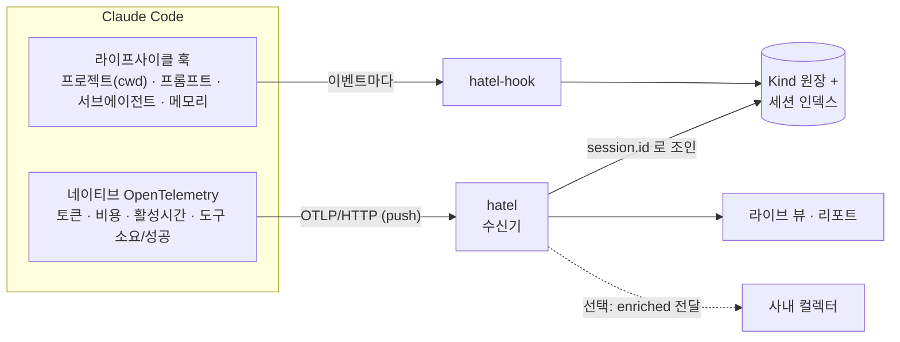
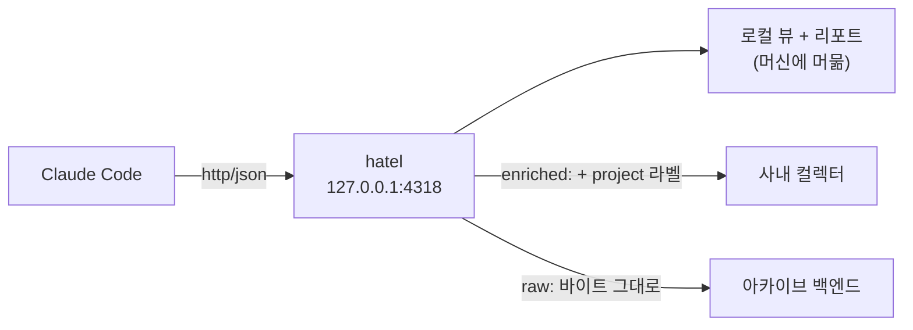

# hatel

[](https://github.com/junyeong-ai/hatel/actions/workflows/ci.yml)
[](#라이선스)

> **[English](README.en.md)** | **한국어**

**Claude Code 텔레메트리를 로컬에서.** 토큰·비용·활성 시간·도구 사용을 **프로젝트·세션·서브에이전트별로** 모읍니다 — 호스팅할 대시보드 없이, 기본적으로 데이터는 당신의 머신을 떠나지 않습니다.

---

## 왜 hatel인가?

- **두 신호를 하나로** — Claude Code가 이미 내보내는 **네이티브 OpenTelemetry**(토큰·비용·도구)와 **라이프사이클 훅**(프로젝트·프롬프트·서브에이전트)을 `session.id`로 조인합니다. 네이티브 OTel에는 "어느 프로젝트인지"가 없는데, hatel이 그걸 채워 **프로젝트별 귀속**을 만듭니다.
- **제로 인프라** — 단일 바이너리, 로컬 OTLP 수신기. 도커도, 대시보드도, 외부 의존도 없습니다.
- **프라이버시 우선** — allow-list가 1차 방어. 프롬프트는 *길이만*, 도구는 *이름만* 저장합니다(본문·인자 저장 안 함). 기본적으로 모든 데이터는 로컬에만 머뭅니다.
- **확장 가능** — TOML 한 장으로 커스텀 지표 추가(코드·재컴파일 없음). CI·배포·게이트 결과도 `emit`으로 기록할 수 있습니다.
- **사내 컬렉터 앞에 끼우기** — 기존 OTLP 컬렉터를 그대로 두고, hatel이 그 앞에 앉아 프로젝트 라벨을 주입해 전달합니다.

---

## 한눈에 보기



- **네이티브 OTel**(push) — 토큰·비용·활성시간·라인, 서브에이전트 귀속(`agent.name`), 도구별 소요/성공(`tool_result` 이벤트). 와이어에 프로젝트가 없어 **세션 인덱스로 조인**합니다.
- **훅**(event) — 프로젝트 컨텍스트(`cwd`)와 OTel이 표현 못 하는 도메인 이벤트: 프롬프트 크기, 메모리 로드, 서브에이전트 종료, 압축 — 그리고 플러그인이 정의한 무엇이든.

| 바이너리 | 역할 |
|---|---|
| `hatel-hook` | `settings.json` 훅에 연결. stdin으로 이벤트 하나를 읽어 매핑·기록 후 종료. async 런타임 없음 — **한 자릿수 밀리초 콜드스타트** (빈 프로세스 spawn 대비 약 1ms). |
| `hatel` | 수신기(`serve`), 리포트, `init`, `service`, `doctor`, `kinds`, `emit`. |

---

## 빠른 시작

```sh
# 1) 설치 — 프리빌트 바이너리(수신기+훅)와 스킬. Rust 불필요
curl -fsSL https://raw.githubusercontent.com/junyeong-ai/hatel/main/scripts/install.sh | bash

# 2) Claude Code에 연결 — settings.json에 텔레메트리 env + 훅을 멱등 병합
hatel init
hatel doctor            # 연결이 제대로 됐는지 검증

# 3) 수신기 실행 — 항상 켜두려면 `hatel service` (아래 참고)
hatel serve --all

# 4) 리포트 보기
hatel report --window 30d
```

> 설치하면서 바로 연결하려면 `... | bash -s -- --wire`. 특정 버전 고정은 `HATEL_VERSION=0.4.1`. 나중에 깔끔히 제거는 `scripts/uninstall.sh`.

---

## 실제로 무엇을 보나

세 명이 `acme-api`·`acme-web`를 작업한 뒤 `hatel report --window 30d` 결과입니다(예시):

```md
# hatel — rolling 30d

| kind | top groups |
|---|---|
| compaction | — |
| memory | — |
| prompt | a1b2c3d4(2), e5f6a7b8(1) |
| subagent | Explore(2), code-reviewer(1) |
| tool | Bash [count=4, duration_ms=5730, ok=3], Edit [count=4, duration_ms=1360, ok=4], Grep [count=1, duration_ms=760, ok=1], Read [count=2, duration_ms=215, ok=2] |

## cost (latest snapshot per session)

| session | project | tokens | cost$ | active_s | lines |
|---|---|---:|---:|---:|---:|
| a1b2c3d4 | acme-api | 248913 | 1.8423 | 1284.6 | 342 |
| e5f6a7b8 | acme-api | 97540 | 0.7218 | 612.3 | 118 |
| c9d0e1f2 | acme-web | 53201 | 0.4087 | 401.7 | 76 |
```

**읽는 법:**

- **`tool`** 행은 도구별로 `[호출 수, 총 소요 ms, 성공 수]`. `Bash [count=4, duration_ms=5730, ok=3]` = Bash를 4번 호출, 합 5.73초(평균 ~1.4초), 4번 중 3번 성공. → **평균 지연과 성공률**이 한 줄에서 나옵니다.
- **`cost`** 표는 세션별 토큰·비용·활성시간·라인 — 전부 **네이티브 OTel**에서.
- **`prompt`·`subagent`**는 **훅**에서 — 세션당 프롬프트 수, 어떤 서브에이전트가 몇 번.

### 라이브 뷰 — `hatel serve`

수신기를 켜두면 세션별·**서브에이전트별** 실시간 롤업이 갱신됩니다:

```text
$ hatel serve --all
hatel receiver on http://127.0.0.1:4318 (all projects) — point OTEL_EXPORTER_OTLP_ENDPOINT here; Ctrl-C to stop

=== hatel (live) ===
session  project                 tokens     cost$ active_s  lines prompts skills decisions
a1b2c3d4 acme-api                248913    1.8423   1284.6    342       2      0         5
  └ Explore                        142035    1.0512
  └ main                           106878    0.7911
e5f6a7b8 acme-api                 97540    0.7218    612.3    118       1      0         3
```

> 들여쓴 `└` 행은 **서브에이전트별 토큰·비용** 분해입니다 — "어느 서브에이전트가 예산을 썼나"가 세션 합계에 묻히지 않습니다.

### 머신 판독용 JSON — `--format json`

대시보드·스크립트·AI 에이전트가 그대로 파싱:

```sh
hatel report --window 30d --kind tool --format json
```

```json
{
  "cost": [],
  "filters": [],
  "kinds": [
    {
      "groups": [
        {
          "count": 4,
          "key": "Bash",
          "sums": [
            { "name": "duration_ms", "sum": 5730.0 },
            { "name": "ok", "sum": 3.0 }
          ]
        }
      ],
      "kind": "tool"
    }
  ],
  "project": null,
  "window": "30d"
}
```

> 키는 알파벳 순으로 직렬화됩니다(`cost·filters·kinds·project·window`). 위는 `Bash` 그룹만 보였고, 실제 리포트엔 `Edit·Grep·Read`가 같은 형태로 이어집니다.

---

## 명령어

| 명령 | 용도 |
|---|---|
| `serve [--port 4318] [--all] [--project N]` | OTLP/HTTP 수신기 + 세션별 라이브 롤업(서브에이전트가 돌면 토큰·비용 분해 포함). |
| `report [--window 30d] [--format md\|text\|json] [--project N] [--kind K] [--top K] [--filter f=v]` | 롤링 윈도우 집계 — 그룹별 레코드 수와 각 Kind `measures`의 합, 그리고 비용 스냅샷. |
| `init [--scope user\|project\|local] [--print] [--remove] [--insert [--mode raw\|enriched]]` | `settings.json`에 텔레메트리 env + 훅을 연결/해제 — 멱등·비파괴·원자적. |
| `service [--remove] [--print]` | 수신기를 launchd/systemd 사용자 서비스로 설치/제거(`serve --all` 실행, 무중단 수집). |
| `doctor` | 연결을 검증하고 정책 공백을 정직하게 보고. |
| `kinds [--json]` | 등록된 Kind(코어+플러그인) 목록. |
| `emit <kind> [key=value...] [--json OBJ]` | 등록된 Kind에 도메인 신호 하나 기록 — 커스텀 지표의 프로그래밍 경로. |

### `report` — 롤링 윈도우 집계

```sh
hatel report --window 30d                          # 전체(기본 markdown) — 위 예시
hatel report --window 7d  --format text            # 터미널용 텍스트
hatel report --window 30d --project acme-api       # 한 프로젝트만
hatel report --window 30d --kind tool              # 한 Kind만(비용 섹션 생략)
hatel report --window 30d --kind tool --top 0      # 그룹 전체(기본 상위 5)
hatel report --window 30d --kind tool --filter tool_name=Bash   # 필드 일치만
hatel report --window 30d --format json            # 대시보드/스크립트용
```

`--project acme-api` 예시 출력:

```text
$ hatel report --window 30d --project acme-api --format text
=== hatel — rolling 30d — project acme-api ===
prompt           a1b2c3d4(2), e5f6a7b8(1)
subagent         Explore(2), code-reviewer(1)
tool             Bash [count=3, duration_ms=4230, ok=2], Edit [count=3, duration_ms=1010, ok=3], Grep [count=1, duration_ms=760, ok=1], Read [count=2, duration_ms=215, ok=2]

--- cost (latest per session) ---
a1b2c3d4 acme-api tokens=248913 cost=1.8423 active=1284.6 lines=342
e5f6a7b8 acme-api tokens=97540 cost=0.7218 active=612.3 lines=118
```

> `--filter field=value`는 `--kind`와 함께 쓰며 반복 가능(모두 일치해야 함). redact 필드는 *원래 값*으로 조회됩니다(저장된 해시와 동일하게 해싱해 매칭 — 원본은 디스크에 닿지 않음).

### `serve` — 수신기 + 라이브 뷰

```sh
hatel serve            # 현재 프로젝트만 (cwd로 판단)
hatel serve --all      # 이 컬렉터를 공유하는 모든 프로젝트
hatel serve --project acme-api   # 특정 프로젝트(라벨)만
```

수신기는 **단일-writer 데몬**입니다: state 디렉터리에 advisory 락을 잡아 같은 디렉터리의 두 번째 수신기는 즉시 물러납니다(비용 스냅샷·도구 원장의 writer는 정확히 하나). 항상 `200`을 답합니다 — 상태는 "본문을 *수신*했음"을 뜻하지 이 빌드가 디코드했는지가 아니라서, 로컬 뷰가 못 읽는 raw 본문도 전달이 성공하고 OTLP 클라이언트는 재시도하지 않습니다(재시도는 delta 카운트를 부풀림).

### `init` — Claude Code에 연결

```sh
hatel init                 # ~/.claude/settings.json (모든 프로젝트)
hatel init --scope local   # .claude/settings.local.json (이 레포, 개발자별)
hatel init --print         # 쓰지 않고 블록만 출력(managed/org 설정용)
hatel init --remove        # 깔끔히 해제(네이티브 텔레메트리 env는 남김)
```

`init`은 **로드된 Kind가 소비하는 이벤트만** 연결합니다(세션→프로젝트 인덱스를 위해 `SessionStart`는 항상). 도구 호출은 여기 없습니다 — 도구의 소요·성공은 훅이 아니라 네이티브 `tool_result` 이벤트에서 옵니다.

Claude Code 자신의 텔레메트리 설정은 `settings.json`의 `env`에 있어야 합니다 — 그게 Claude Code가 세션 시작 시 읽는 유일한 채널이고, 그 `OTEL_*` 변수는 의도적으로 훅 서브프로세스에 **전달되지 않습니다**. 두 레이어가 분리된 이유가 바로 이것입니다. 전체 형태:

```jsonc
{
  "env": {
    "CLAUDE_CODE_ENABLE_TELEMETRY": "1",
    "OTEL_METRICS_EXPORTER": "otlp",
    "OTEL_LOGS_EXPORTER": "otlp",
    "OTEL_EXPORTER_OTLP_PROTOCOL": "http/json",
    "OTEL_EXPORTER_OTLP_ENDPOINT": "http://127.0.0.1:4318"
  },
  "hooks": {
    "SessionStart":      [{ "hooks": [{ "type": "command", "command": "hatel-hook" }] }],
    "UserPromptSubmit":  [{ "hooks": [{ "type": "command", "command": "hatel-hook" }] }],
    "SubagentStop":      [{ "hooks": [{ "type": "command", "command": "hatel-hook" }] }],
    "InstructionsLoaded":[{ "hooks": [{ "type": "command", "command": "hatel-hook" }] }],
    "PreCompact":        [{ "hooks": [{ "type": "command", "command": "hatel-hook" }] }]
  }
}
```

> `http/json`이 필요합니다(수신기는 JSON OTLP 인코딩을 디코드하므로 protobuf 의존이 없습니다). 위에선 가독성을 위해 `command`를 짧은 이름으로 적었지만, `hatel init`은 `hatel` 옆의 `hatel-hook` **절대경로**를 씁니다 — `PATH` 의존 없이 spawn되도록.

### `doctor` — 연결 진단

`doctor`는 추측하지 않고 정직하게 보고합니다 — 신호가 빠지면 빠졌다고 말하고 그 결과를 설명합니다:

```text
$ hatel doctor
hatel doctor

settings files:
  user     found    ~/.claude/settings.json
  project  absent   ./.claude/settings.json
  local    absent   ./.claude/settings.local.json
  managed  absent   /Library/Application Support/ClaudeCode/managed-settings.json

native telemetry (settings.json env):
  ✓ CLAUDE_CODE_ENABLE_TELEMETRY=1 (from user)
  ✓ OTEL_METRICS_EXPORTER=otlp (from user)
  ✓ OTEL_LOGS_EXPORTER=otlp (from user)
  ✓ OTEL_EXPORTER_OTLP_ENDPOINT=http://127.0.0.1:4318 (from user)
  ✓ OTEL_EXPORTER_OTLP_PROTOCOL=http/json (from user)
  ✓ session.id included in metrics (default on)

hooks:
  ✓ all 5 lifecycle events invoke `hatel-hook`

storage:
  ✓ state dir writable: ~/.local/state/hatel

export:
  • http://collector.acme.internal:4318 (enriched, only: acme-api, acme-web, 1 header(s))
  ⚠ egress forwards the raw OTLP stream off this host — hatel does not redact it
  ✓ OTel is routed through this receiver — export has a stream to forward
```

### `emit` / `kinds`

```sh
hatel kinds                                         # 등록된 Kind와 필드
hatel emit ci_check check=lint runs:=14000 failures:=3   # 도메인 신호 기록
```

`hatel kinds` 출력(코어):

```text
$ hatel kinds
compaction     group_key=session_id   fields=[project, session_id, trigger]
memory         group_key=memory_id    fields=[load_reason, memory_id, memory_type, project, session_id]
prompt         group_key=session_id   fields=[project, prompt_len, session_id]
subagent       group_key=subagent_type fields=[project, session_id, subagent_type]
tool           group_key=tool_name    fields=[duration_ms, ok, project, session_id, tool_name]
```

---

## 다른 컬렉터로 전달 (export)

수신기는 받은 것을 하나 이상의 **다운스트림 OTLP/HTTP 컬렉터**로 전달할 수 있습니다. hatel과 사내 컬렉터 중 택일할 필요가 없습니다 — hatel이 앞에 앉아 tee 합니다.



`config.toml`(`$HATEL_CONFIG`, 없으면 `<config-dir>/hatel/config.toml`)에 목적지를 설정합니다. `[[export]]` 하나가 한 목적지 + 거기로 갈 때 적용할 변환입니다:

```toml
[[export]]
endpoint = "http://collector.corp:4318"   # /v1/metrics, /v1/logs 가 자동 추가됨
mode = "enriched"                            # raw | enriched
headers = { authorization = "…" }            # 예: 다운스트림 인증(값은 로깅 안 함)
exclude_projects = ["scratch"]               # 이 프로젝트만 빼고 전부 전달…
# projects = ["acme-api", "acme-web"]        # …또는 이것만 허용(둘 다는 불가)
# timeout_ms = 5000
```

- **`raw`** — 들어온 OTLP를 바이트 그대로 전달(프로토콜 무관, protobuf 본문도 tee).
- **`enriched`** — `session.id`로 조인한 `project` 라벨을 각 datapoint/record에 주입 → 다운스트림이 raw OTel엔 구조적으로 없는 **프로젝트별 귀속**을 얻습니다. 변환하려면 `http/json` 스트림 필요. 세션을 모르는 datapoint는 그대로 전달(라벨을 절대 지어내지 않음).
- **`projects` / `exclude_projects`** — 특정 프로젝트를 목적지에서 가리기(허용-목록 또는 제외-목록, 둘 중 하나). 라벨(git-root basename) 또는 키(절대 git-root 경로)로 매칭. 프로젝트를 아직 못 푼 배치는 **fail-closed**(필터 목적지로 전달 안 함) — 개인 프로젝트가 startup race에 사내 컬렉터로 새지 않습니다.

> **egress는 redact되지 않습니다.** `raw`/`enriched`는 전체 OTLP 본문을 호스트 밖으로 보냅니다. hatel의 allow-list/해싱은 *훅 원장*에 적용되지 *이 egress*엔 아닙니다. export가 설정되면 `doctor`가 이를 상시 경고로 출력합니다. (단, hatel은 본문이 없는 설계라 프롬프트·도구 본문을 나르지 않으므로, Claude Code의 raw OTel을 사내 컬렉터에 직접 꽂는 것보단 안전합니다.)

### 기존 컬렉터 앞에 hatel 끼우기

Claude Code의 endpoint가 이미 사내 컬렉터를 가리킨다면, 한 명령으로 그걸 잡아 export 타깃으로 만들고 Claude Code를 hatel로 재지정합니다 — 컬렉터는 유지, hatel은 추가:

```sh
hatel init --insert                 # 현재 endpoint를 enriched 타깃으로 잡고 CC 재지정
hatel init --insert --mode raw      # …바이트 그대로 전달
```

endpoint가 **managed-locked**라 재지정 불가면 `doctor`가 명확히 알려줍니다(이 경우 훅 원장만 사용 가능).

---

## 커스텀 지표 (플러그인)

플러그인은 **TOML 스키마 파일** 하나입니다 — 코드도, 재컴파일도 없습니다. 코어와 같은 로더로 Kind(그리고 선택적 훅 바인딩)를 추가합니다. `HATEL_PLUGINS=path/to/plugin.toml`로 지정(여러 개면 OS 경로 구분자).

Kind당: `fields`(단일 allow-list), `group_key`(리포트가 묶는 필드), `measures`(리포트가 **합산**하는 숫자 필드 — 첫 번째가 정렬 기준), `redact`(저장 전 해싱).

커스텀 Kind는 **신호가 어디서 나오는지**에 따라 두 경로 중 하나로 채웁니다(한 Kind엔 writer 하나 — 둘 다면 이중 집계):

**1) 훅 바인딩** — Claude Code 라이프사이클에서 유도 가능한 신호, 코드 없음:

```toml
[[kind]]
name = "team.deploy"
fields = ["session_id", "project", "service", "ok"]
group_key = "service"

[[binding]]
event = "PostToolUse"
kind = "team.deploy"
map.session_id = { from = "session_id" }
map.service    = { from = "tool_name" }
map.ok         = { from = "tool_response", present = true }
```

> 필드맵 변환: `from`(패스스루; 리스트면 순서대로 시도), `capture`(정규식 그룹 1), `len`(문자열 길이), `present`(존재 여부 bool), `basename`(경로 마지막 조각), `const`. 적용 안 되는 변환은 필드를 생략 — 절대 지어내지 않습니다. 바인딩이 `git_branch`를 쓸 때만 훅이 `.git/HEAD`를 읽어(서브프로세스 없음) `map.spec_slug = { from = "git_branch", capture = "^spec/(.+)$" }` 같은 슬러그 유도가 가능합니다.

**2) `emit`** — Claude Code 이벤트가 *아닌* 도메인 신호(스펙-게이트 결정, 룰-체크 롤업, 배포 결과). 당신의 도구가 직접 기록:

```sh
# key=value 는 문자열, key:=value 는 JSON(숫자·bool·배열)
hatel emit ci_check check=lint date=2026-06-09 runs:=14000 failures:=3
# 또는 --json 으로 객체 통째로, 혹은 stdin 파이프
echo '{"check":"lint","runs":14000}' | hatel emit ci_check
```

`emit`은 Kind를 검증하고 같은 allow-list·redaction을 적용해 활성 sink에 씁니다. Kind가 받지 않는 필드는 드롭하되 **허용 필드 목록과 함께 stderr로 경고** — 오타가 바로 드러납니다. 언어 무관(어떤 프로젝트·언어든 바이너리를 호출). 훅과 달리 `emit`은 cwd로 프로젝트를 추측하지 **않습니다**(스케줄러·CI가 어디서든 돌 수 있어 추측은 오귀속). 크로스-프로젝트 분석에는 원하는 귀속(`project`, 슬러그, 조직)을 페이로드 필드로 넣으세요. `plugins/example.toml`이 동작 예제입니다.

---

## 저장소 & 설정

저장의 두 면이 하나의 추상화(`HATEL_SINK`)를 거칩니다 — emitter는 sink로 쓰고, `report`는 같은 백엔드로 읽습니다(리포트는 SQLite든 JSONL이든 동일하게 소비):

- **`jsonl`**(기본) — Kind당 append-only 파일 하나, 10MB(`HATEL_ROTATE_BYTES`)에 회전. git 친화·grep 가능·의존성 0.
- **`sqlite`** — 임베디드, WAL, `(kind, ts)` 인덱스 — 윈도우 읽기를 SQL에서 필터.

상태는 XDG state 디렉터리(`~/.local/state/hatel` 또는 플랫폼 등가)에 저장, `HATEL_STATE_DIR`로 재정의. 세션 인덱스와 비용 스냅샷은 sink와 무관하게 항상 거기 기록됩니다(수신기가 프로젝트 없는 OTel 데이터를 귀속하려면 인덱스가 필요).

### 환경 변수

| 변수 | 효과 |
|---|---|
| `HATEL_SINK` | `jsonl`(기본) / `sqlite` |
| `HATEL_STATE_DIR` | 상태 디렉터리 재정의 |
| `HATEL_CONFIG` | `config.toml`(export 목적지) 경로 재정의 |
| `HATEL_PLUGINS` | 플러그인 TOML 경로, OS 경로 구분자(`:` Unix, `;` Windows) |
| `HATEL_ROTATE_BYTES` | JSONL 회전 임계값(기본 10MB) |
| `HATEL_RETENTION_DAYS` | 저장 전체의 보존 기간 — 비용 스냅샷·회전 원장·SQLite 행(기본 90, 최대 100000). 수신기가 매일 sweep하되 활성 원장 파일은 건드리지 않음 |
| `HATEL_DISABLED=1` | 훅을 no-op으로 |
| `HATEL_STRICT=1` | allow-list 밖 페이로드 키를 (조용히 드롭하지 않고) 에러 |
| `HATEL_TESTING=1` | `_test/` 하위로 쓰기 리디렉트 |

> 이 변수들은 *수집기 자신*을 설정하며, `settings.json`에 사는 Claude Code의 `OTEL_*` 텔레메트리 설정과는 무관합니다.

---

## 프라이버시

- **allow-list가 1차 방어** — 코어엔 본문 필드가 **없습니다**. 프롬프트는 길이만, 도구는 이름만(텍스트·인자 저장 안 함). Claude Code 자신의 기본-off `OTEL_LOG_USER_PROMPTS` / `OTEL_LOG_TOOL_DETAILS`와 동일한 입장.
- `redact` 필드는 저장 전 해싱(BLAKE3, 16 hex).
- 이벤트 레코드는 프로젝트 **라벨**만 — 절대 git-root 경로는 로컬 세션 인덱스에만.
- 전부 로컬에. 실패는 fail-open: 쓰기 오류는 stderr 메모로 degrade되지 도구 호출을 막지 않습니다.

## 항상 켜두기 (무중단 수집)

네이티브 OTel은 push 전용이라 수신기가 켜져 있을 때만 토큰·비용이 잡힙니다. 무중단 사용자-레벨 수집은 백그라운드 서비스로 설치하세요 — `hatel`이 유닛을 직접 쓰고 로드합니다(macOS launchd, Linux systemd `--user`):

```sh
hatel service           # 설치+시작: `serve --all` 실행, 로그인/실패에 무관하게 유지
hatel service --remove  # 중지·제거
hatel service --print   # 설치 대신 유닛 출력(검토·MDM 전달용)
```

> 유닛은 자신을 설치한 바로 그 바이너리를 실행하므로, `cargo install`이나 경로 이동 후 `hatel service`를 다시 돌리면 재지정됩니다. (`scripts/install.sh --service`가 설치와 같은 단계에서 이걸 합니다.)

## 엔터프라이즈 / managed 설정

수집기는 managed 정책과 싸우지 않고 적응합니다:

- **OTel이 사내 컬렉터로 재지정됨** — 로컬 훅 원장은 계속 작동. `session.id` 조인이 네이티브 데이터가 어디 떨어지든 유지되어, 사내 백엔드의 메트릭과 로컬 도메인 원장이 세션으로 조인됩니다.
- **`allowManagedHooksOnly`** — user/project 훅이 차단되면 IT가 `hatel-hook`을 *managed* 훅으로 배포(단일 정적 바이너리를 MDM으로). `doctor`가 파일 기반 managed 설정에서 감지.
- **`OTEL_METRICS_INCLUDE_SESSION_ID=false`** — 세션별 귀속이 불가능. `doctor`가 명확히 보고; org/user 집계는 여전히 작동. 추측 fallback은 없습니다 — 못 쓰는 신호는 못 쓴다고 보고하지 지어내지 않습니다.

---

## 구조

```
crates/core   async-free 라이브러리: model, registry, schema, pii, rolling, sinks, session, hook, report
crates/hook   가벼운 훅 바이너리(core만)
crates/cli    수신기, 리포트, doctor (core + tokio/axum)
plugins/      선언적 플러그인 예제
```

## 라이선스

MIT OR Apache-2.0.
